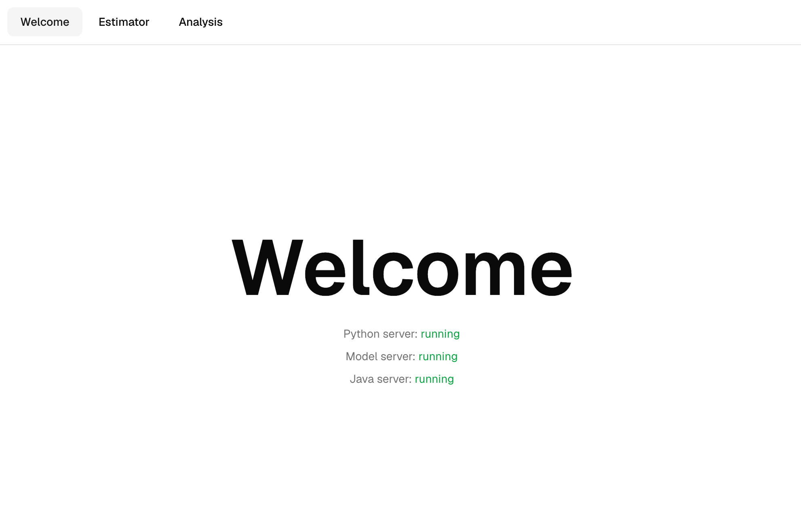
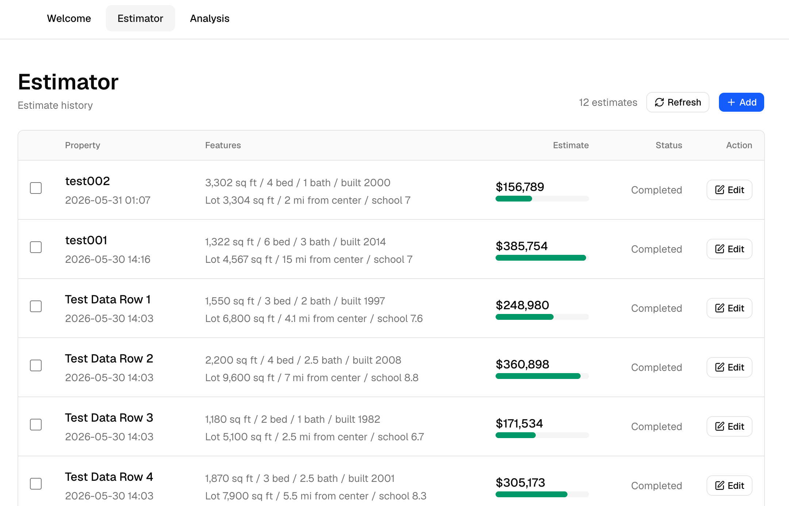
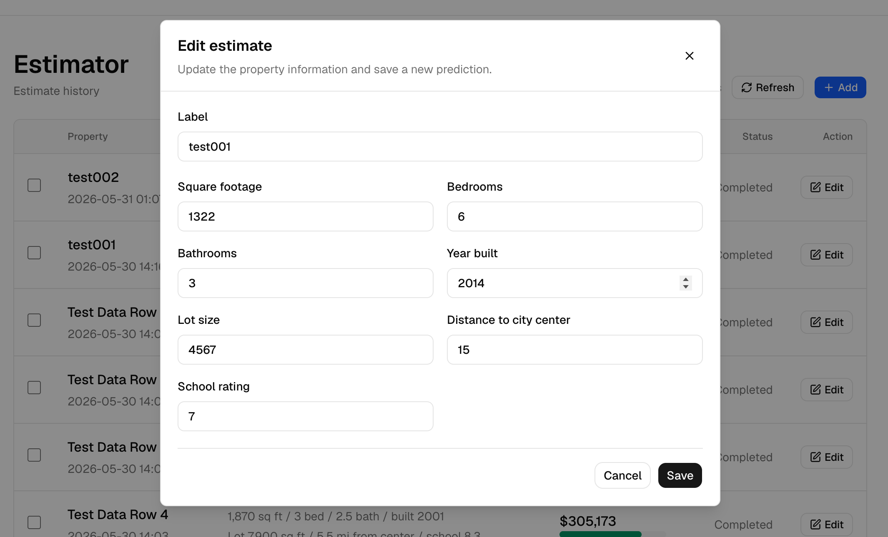
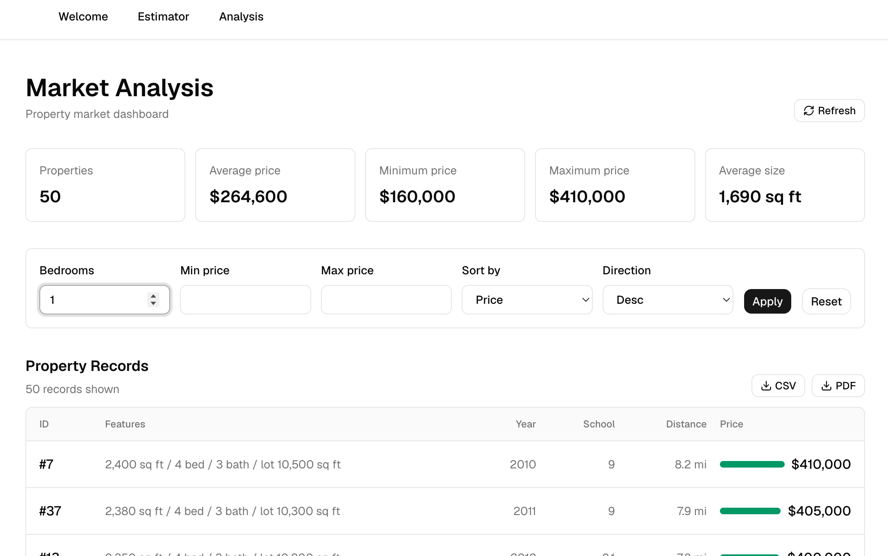
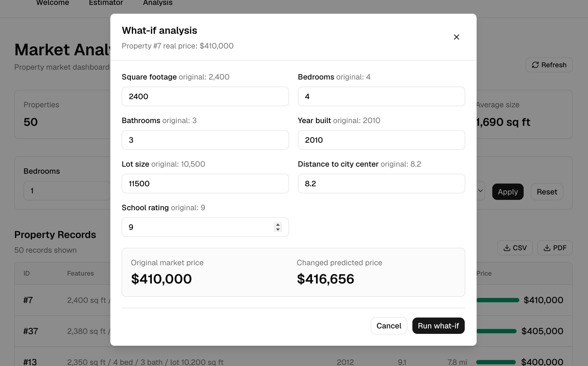

# Interview Tasks Fullstack

Full-stack housing price demo for the interview task.

The project includes:

- Task 1: Python FastAPI model API for house price prediction
- Task 2 App 1: Property Value Estimator with Python backend
- Task 2 App 2: Property Market Analysis with Java Spring Boot backend
- Next.js portal with shared navigation, loading/error states, dashboard, history, comparison, what-if analysis, and exports

## Screenshots

### Welcome



### Property Value Estimator



### Edit Estimate



### Market Analysis



### What-if Analysis



## Project Structure

```text
.
├── 1_1_predict_model/      # FastAPI ML model service
├── 2_1_frontend/           # Next.js portal
├── 2_2_backend_py/         # Python estimator backend
├── 2_3_backend_java/       # Java Spring Boot market backend
├── _requirements/          # PDF brief and CSV datasets
└── screenshot/             # UI screenshots
```

## Main Features

- Train and serve a scikit-learn regression model
- Predict single or batch house prices
- Show model info, coefficients, and metrics
- Save and compare estimator history
- Market dashboard with filters, sorting, and price bars
- What-if analysis powered by the ML model
- CSV and PDF export options
- Server health checks for Python, model, and Java services

## Run The Project

### 1. Start the model API

```bash
docker compose up --build model-api
```

Model API:

- API: `http://localhost:8000`
- Swagger: `http://localhost:8000/docs`
- Health: `http://localhost:8000/health`

The Docker startup trains the model before launching FastAPI.

### 2. Start the Python estimator backend

```bash
cd 2_2_backend_py
python -m venv .venv
source .venv/bin/activate
pip install -r requirements.txt
uvicorn server_py.main:app --host 0.0.0.0 --port 8001 --reload
```

Python backend:

- API: `http://localhost:8001`
- Health: `http://localhost:8001/health`

### 3. Start the Java market backend

Requires Java 21.

```bash
cd 2_3_backend_java/market-analysis
./mvnw clean spring-boot:run
```

Java backend:

- API: `http://localhost:8080`
- Health: `http://localhost:8080/actuator/health`

### 4. Start the Next.js frontend

```bash
cd 2_1_frontend/next_app
npm install
npm run dev
```

Frontend:

- Portal: `http://localhost:3000`

## Useful Checks

```bash
cd 2_1_frontend/next_app
npm run lint
npm run typecheck
npm run build
```

```bash
cd 2_3_backend_java/market-analysis
java -version
./mvnw -v
./mvnw help:evaluate -Dexpression=project.parent.version -q -DforceStdout
```

Expected:

- Java: `21`
- Spring Boot: `3.4.4`

## Data

Datasets live in `_requirements/`:

- `House Price Dataset.csv`
- `Test Data For Prediction.csv`
- `Interview Tasks Fullstack.pdf`

Model fields:

- `square_footage`
- `bedrooms`
- `bathrooms`
- `year_built`
- `lot_size`
- `distance_to_city_center`
- `school_rating`
